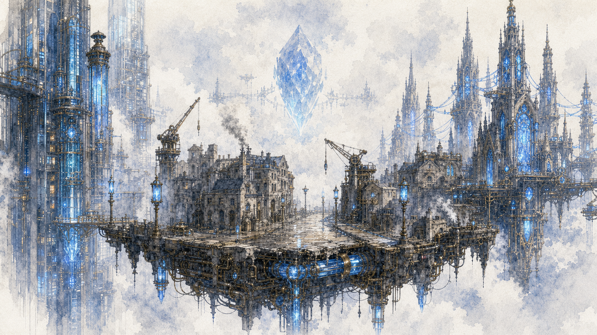
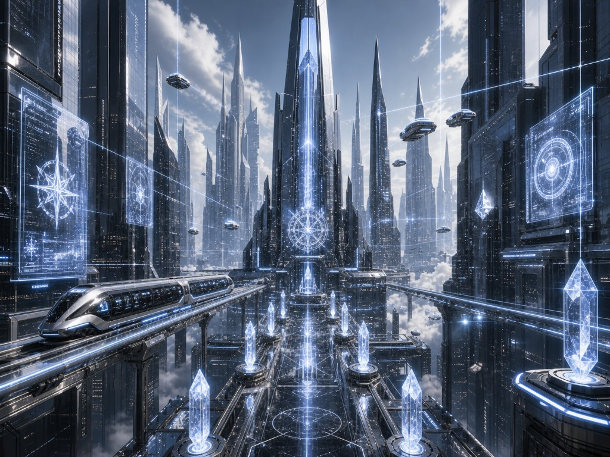
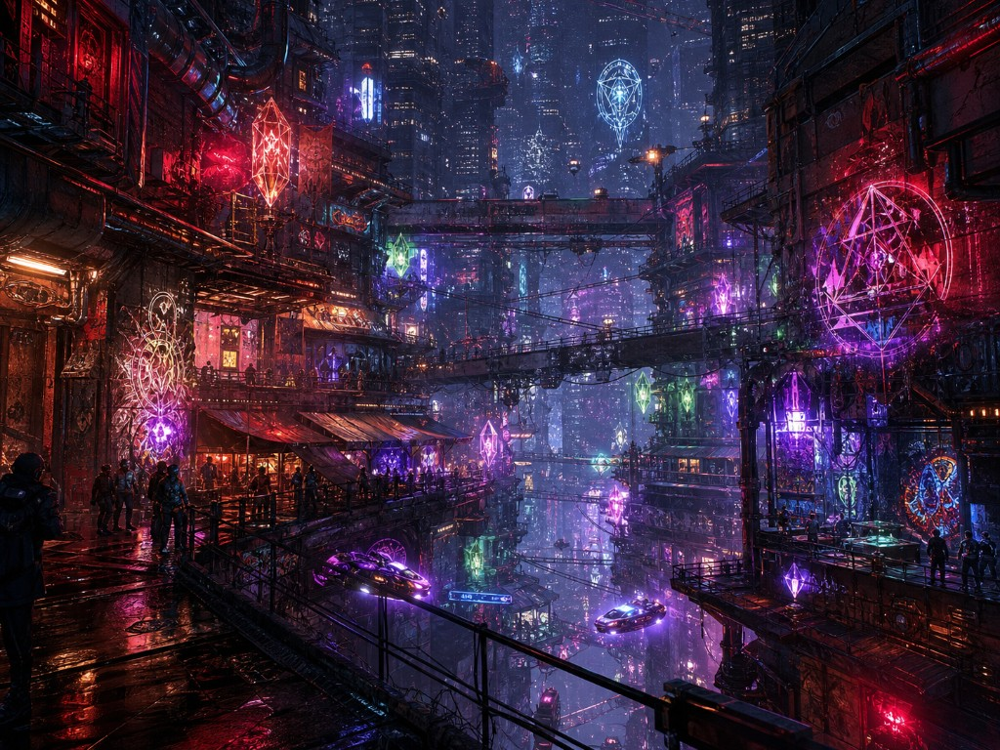
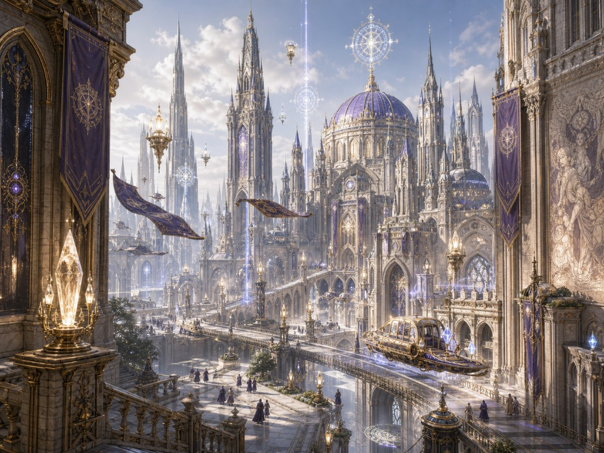

<p align="center">
  
</p>

<h1 align="center">Aetherpunk</h1>

<p align="center">
  <strong>An AI-narrated web tabletop RPG backed by local game rules.</strong>
</p>

<p align="center">
  <a href="README.md">中文</a> · English · <a href="README_JP.md">日本語</a>
</p>

<p align="center">
  
  
  
</p>

## Connect to Arcadia

**Aetherpunk** is a web tabletop RPG built around AI narration and grounded by local rule systems.

No fixed options. No prewritten ending. No one is waiting for you to make the “correct” choice.

You are entering **Arcadia**, a city that answers, remembers, and collects its debts. Everything you do here becomes part of it, whether you want that or not.

## World · Arcadia

Above the city hangs Akasha’s transmission crystal. It is vast, bright, and cold enough to throw blue-white light into the rainwater on the streets. It also records every spell you cast into a central server.

Gothic towers, Hellenic halls, and ruthless elite business architecture are crowded into the same city, stitched together by luminous magical conduits and sky-rail traffic. Arcadia feels like a contradiction that learned how to keep running. Most residents carry mixed bloodlines: elf-descended ears, winged ancestry, patches of dragon scale, and countless bodies no registry can classify. Pure blood is already a myth. Arcadia does not care where you came from. It cares about your social-credit rating.

**The Arcanet** is the nervous system that keeps it all alive. It is efficient, stable, cheap, and almost impossible to refuse: casting, identity, payment, messaging, and surveillance bundled into one subscription. Akasha calls it convenience. The Codex Chorus calls it the most beautiful, comfortable, and unbreakable cage ever built.

## Three Orders, One City

<p align="center">
  
  
  
</p>

### The Suit · Corporate Order

> “Authorized. Certified. Recorded.”

Skyscrapers rise in ranks, holographic billboards cover the skyline, and air traffic moves with disciplined precision. The Arcanet’s core offices live here. Compliance is the rule, efficiency is the god, prediction is the weapon.

### The Street · Underground Network

> “No headquarters. No leader. No signature.”

Layered streets, neon, graffiti, basement clubs, and Chorus signs written in the corners of walls. Everyone the mainstream refused to accept is here, surviving with whatever they brought with them.

### The Academy · Old Tradition

> “Honor first. Permission second. The threshold always remains.”

Ancient buildings carry the weight of history: the highest schools of magic, old noble estates, vast churches, and an etiquette system that sews traditional spellcraft to modern access control. Elegance is a weapon. Class never disappeared.

## Three Districts, Three Pressures

| District | Texture | What You Feel There |
| --- | --- | --- |
| **Nexus** | Corporate interfaces, holographic ads, surveillance crystals | Every spell leaves a mark. Every step is recorded. |
| **Bleed** | Neon, graffiti, hot oil, black-market mods | The hallucinatory smell of Rushdust, the noise of modified terminals, Chorus signs in wall corners. |
| **Spire** | Academy etiquette, classical research, noble heraldry | Everyone is measuring your bloodline and permission level. |

## History Is Still Breathing

When the Aether was discovered, mages believed a truly connected age was about to begin. Then Akasha arrived.

In the fifteenth year of the Arcanet, the Purification Act banned all “uncertified” magical knowledge. Every spell had to pass Arcanet review. The official reason was public safety. The real reasons were monopoly, the destruction of competition, and total surveillance.

**The Codex Chorus** did not vanish. It went underground, parasitizing the Arcanet’s own Aether currents like a hidden undertow, continuing to breathe after Akasha thought it was dead.

- **Ten years ago**, Cleansing Day knocked the Chorus offline for 72 hours. Many nodes went permanently silent. No one explained what happened.
- **Five years ago**, something proved the underground network could not be fully erased.
- **Three years ago**, the social-credit algorithm source code leaked, proving Akasha was using magic to predict “dangerous people.” Chorus membership multiplied fivefold within months.

These dates live inside NPC trauma, mission motives, and the small silences that pass through certain conversations.

## Magic · Aether Technology

Magic in this world has version numbers, compatibility problems, forced updates, and the risk of revoked authorization.

| Concept | Meaning |
| --- | --- |
| **Aether** | A magical energy field spread across the world. Consciousness and information move through it, and sometimes rot inside it. At times you hear its low-frequency resonance, like millions whispering at once. |
| **Terminal Magic** | Spells ported into apps, plugins, black-market modules, and hardware loadouts. Casting Spark on street food through a personal terminal, or bypassing Arcanet authorization through a modified module, are both terminal magic. |
| **The Arcanet** | Akasha’s centralized magical infrastructure. The transmission crystal above the city is its central server: stable, efficient, and fully surveilled. |
| **Codex Chorus** | A leaderless underground knowledge network sustained by node consensus, ghost protocols, and active memory. Its spells have version histories, evolution trees, and user ratings, like living open-source projects. |
| **Aether Weather** | Rain, fog, storms, aether rain, crystal mist. Weather changes the pressure of a scene and the space of available choices. |
| **The Echo** | A strange sound that sometimes appears while using the Chorus, like millions whispering together. No one is sure what it is. |

Terminal noise, the cold light of floating crystals, flickering holographic ads, social-credit alerts, trace exposure, low aether frequencies, memory displacement: once modern technology and occult force completely overlap, the seam between them is no longer visible.

## Gameplay · Become a Runner

### 1. Create Your Runner

Start with bloodline, faction, origin, attributes, terminal, and gear. Answer narrative questions. Build a person with injury records, old relationships, and resource gaps. Then carry all of that into Arcadia.

### 2. Take a Briefing

Every job has objectives, contacts, known risks, and possible consequences. Choose a structured contract, or walk into a district and let your current character state decide how the city responds.

### 3. Build a Crew

Choose a primary Runner and up to two companions. Companions have equipment, inventory, stances, and values. Some doors cannot be opened alone. Some trades become entirely different prices because of affinity or faction ties.

### 4. Act in Natural Language

Sneak, negotiate, threaten, investigate, withdraw, buy services, ask an NPC for help, move items, or start a fight. Describe what you want to do. The AI narrates how the world responds. The local systems save and validate every key result.

Your action will not be overwritten by the next round of dialogue.

### 5. The World Keeps Moving

Arcadia does not wait when you leave. Time advances, weather changes, NPCs accumulate affinity and incidents, locations keep memories, and missions are archived.

The unfinished business you left behind is becoming someone else’s motive.

## Systems · Everything Leaves a Record

- **Narrative has evidence.** Objectives, character resources, combat, trade, NPC relationships, and mission settlement are tracked locally. The game does not rely on memory or re-description.
- **The world remembers what you did.** NPC files, location memory, weather history, and run saves stack choices into long-form story. People you helped remember. People you harmed remember too.
- **NPCs exist.** Mission characters and generated scene NPCs can enter the archive with personality, pronouns, bloodline ties, historical events, and combat records. They do not disappear after a mission unless you make them disappear.
- **Arcadia is an interactive stage.** District pressure, aether weather, faction movement, social-credit status, Chorus nodes, and Arcanet surveillance are constraints and opportunities at the same time.
- **Runners grow over time.** Attribute gains, Specialty unlocks, terminal app expansion, equipment mounts, accumulated injuries, and mission history shape each Runner’s unique style and place in the city.

## This Is For You If

- You like cyberpunk, urban fantasy, industrialized magic, and underground network stories.
- You want natural-language tabletop play without losing character assets, relationships, and state.
- You want the AI to act like a real narrator.
- You want to build long-term characters, NPC files, and city memory into your own story database.

## Local Setup

```powershell
npm install
npm run dev
```

Open the local URL, choose **New Runner** to create a character, enter **New Mission** to pick a briefing, then use **Continue** to connect to the current run.

---

<p align="center">
  <strong>Connection established.</strong><br>
  Welcome to Arcadia, Runner.
</p>
